# Shigen Senso Server

The Shigen Senso Server is the backend component of the Shigen Senso game, responsible for managing game state, handling client requests, and ensuring smooth gameplay. This repository contains the server-side code developed using C# and various supporting technologies.

## Overview

The Shigen Senso Server provides the necessary infrastructure to support a multiplayer strategy game. It manages player data, game sessions, resource generation, and combat mechanics. The server ensures that all players have a consistent and fair experience by maintaining authoritative control over the game state.

## Key Features

### Game State Management

- **Player Data**: Stores and manages data related to each player, including resources, structures, units, and progress.
- **Game Sessions**: Manages active game sessions, allowing players to join, leave, and interact within the game world.
- **Resource Generation**: Handles the generation and distribution of resources based on player activities and game events.

### Networking and Communication

- **Real-Time Communication**: Uses TCP/IP to provide real-time communication between the server and clients, ensuring low-latency updates and interactions.

### Combat Mechanics

- **Battle Management**: Handles combat scenarios between players, including attack resolution, defense calculations, and outcome determination.
- **Unit Management**: Manages the creation, movement, and actions of units within the game world.

### Pathfinding and Map Generation

- **Pathfinding**: Implements pathfinding algorithms to ensure that units can navigate the hexagonal grid map effectively.
- **Map Generation**: Supports dynamic generation of the game map, ensuring a unique and balanced layout for each game session.

## Game Demo
- https://youtu.be/0ALPqSQx0po

## Images 

### Hexagon Types
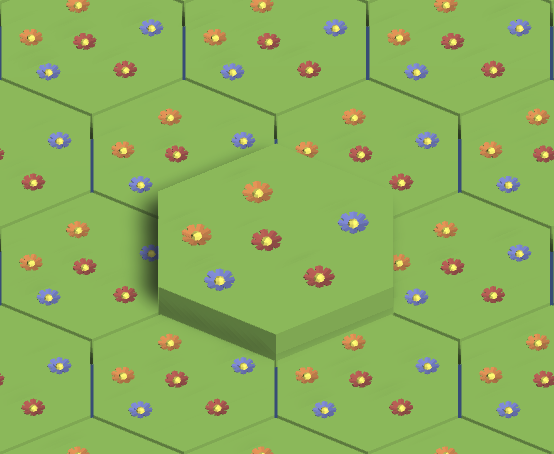
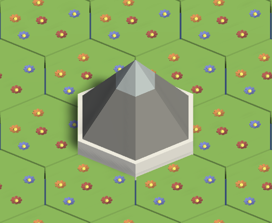
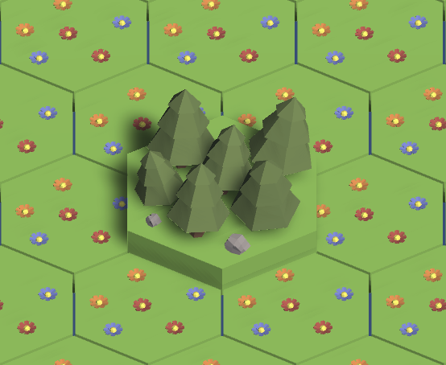
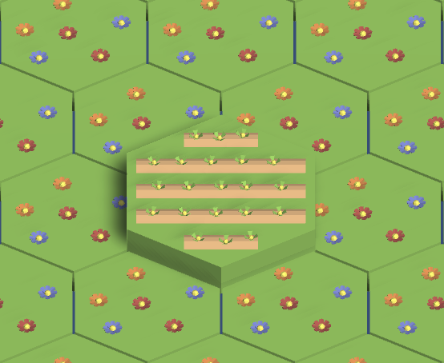

### Map
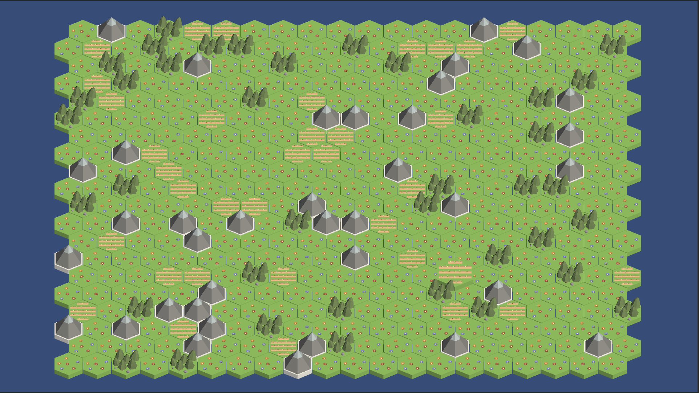

### Structures
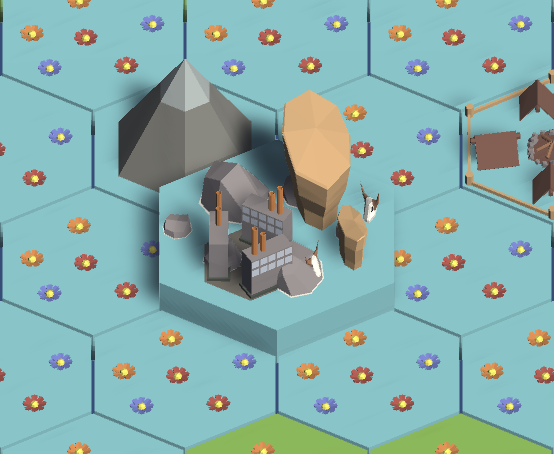
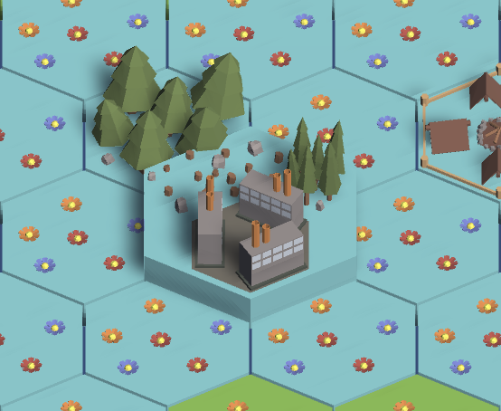
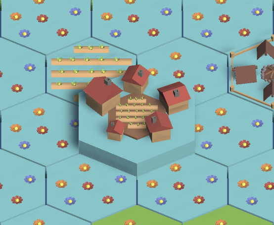

### Resource Collection

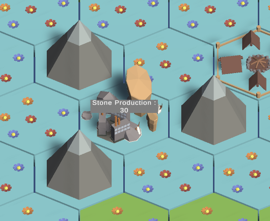

### UI
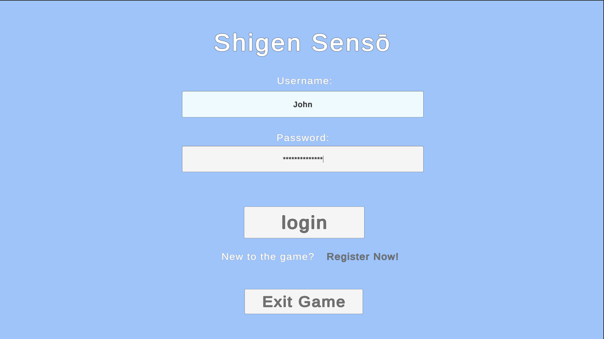
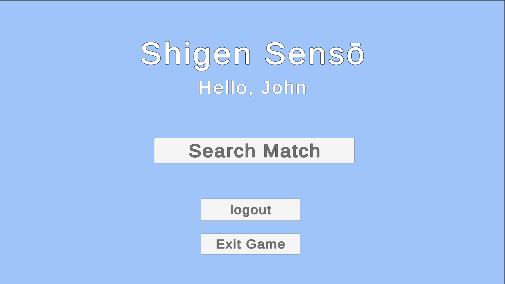
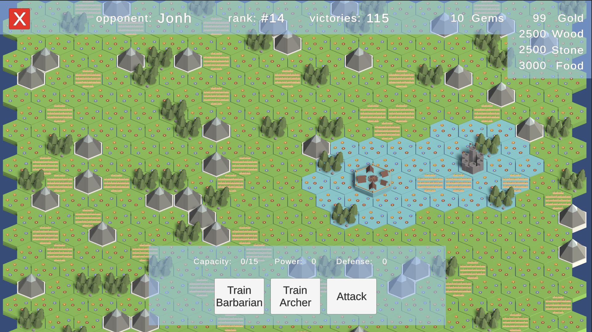
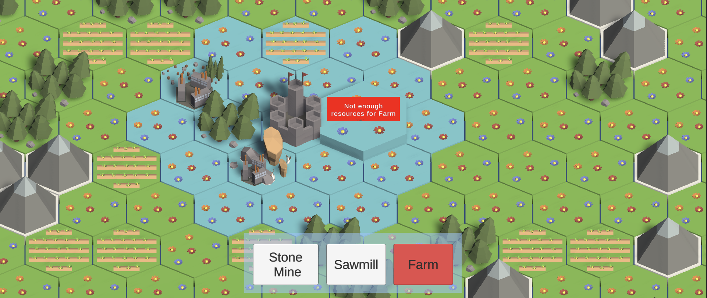
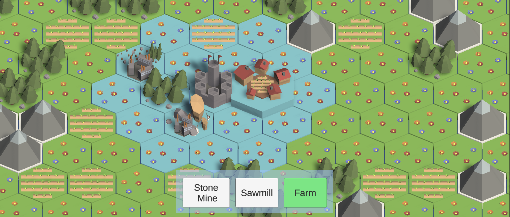

### Pathfinding
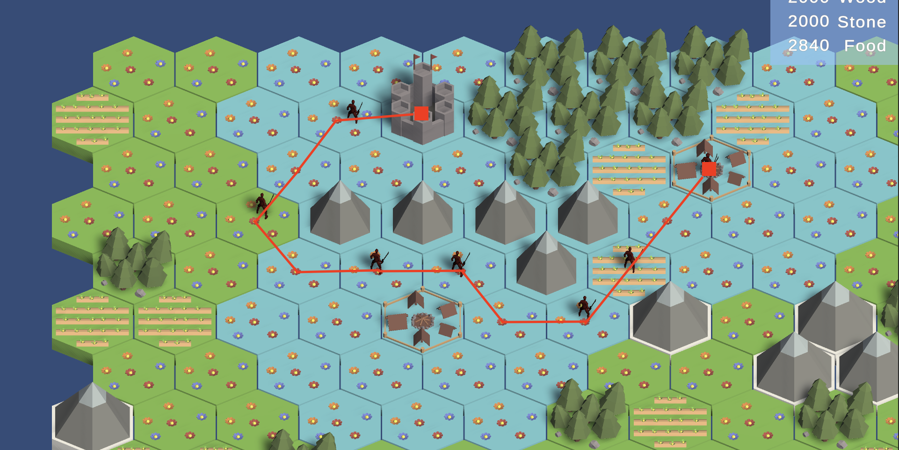
